------------------------------------------------------------------------

{fig-align="center"}

::: notes
"SUTs are the foundation of several policy relevant modelling tools: They are used to create environmentally-extended MRIOs such as EXIOBASE, or serve as the base for Social Accounting Matrices and CGE models. However, when those models are used to inform decision-making it is important to know how robust their results are. Therefore, it is crucial to know the robustness of the foundations – the Supply Use Tables – in the first place.

Today, I will present you a framework of how to assess the uncertainty or robustness of SUTs.

"
:::

------------------------------------------------------------------------

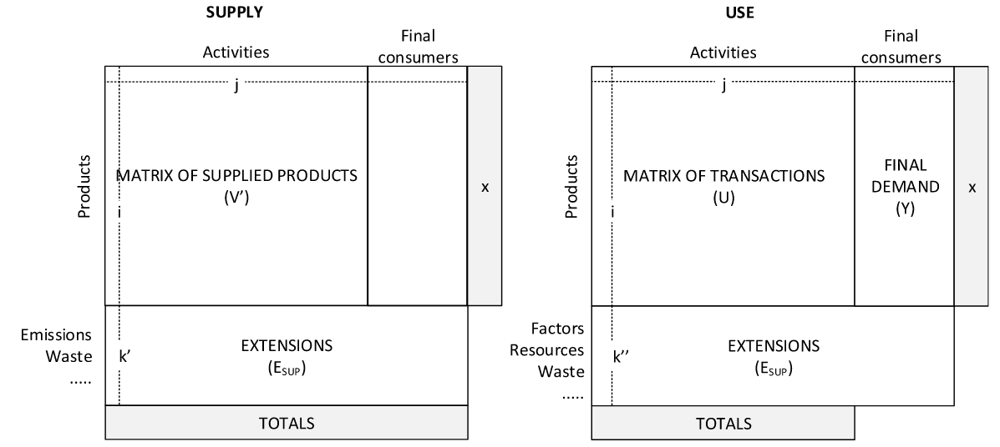

------------------------------------------------------------------------

## BONSAI

::::: columns
::: {.column width="50%"}
-   Open climate footprint database: [bonsai.uno](bonsai.uno)

-   **Hybrid Supply-Use** system with multiple property layers

-   Layers are coupled via **conversion factors** (e.g., €/t, TJ/t, €/TJ)

-   dimensions: \~1700 products × \~1500 activities × 49 regions → **\>1.8M non-zero flows**
:::

::: {.column width="50%"}
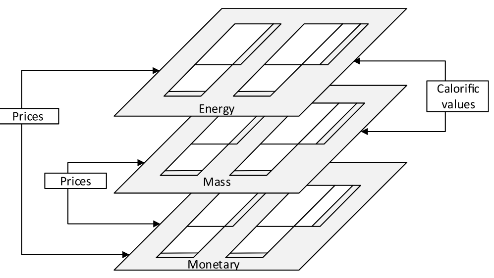
:::
:::::

------------------------------------------------------------------------

## Central role of balancing in SUT compilation

-   (hyrid) SUTs are compiled from heterogeneous, incomplete and sometimes conflicting data sources

-   need for balancing (reconciliation) to satisfy key accounting and consistency constraints: e.g. supply = demand, input = output

-   Standard balancing (RAS, KRAS, WLS, cross-entropy, ...) yields **a single reconciled table** (often without uncertainty)

------------------------------------------------------------------------

## The challenge

We need a balancing method that:

1.  can use heterogeneous **reliability information** in the balancing step

2.  provides the **uncertainty for the balanced table**

3.  accounts for **dependence induced by constraints**

4.  supports for **downstream uncertainty propagation** (e.g. $P(\mathrm{A}) > P(\mathrm{B})$)

5.  **scales** to the size of BONSAI

------------------------------------------------------------------------

## The Bayes' Theorem

$$
{\color{#2E5CB8}{ p(\text{SUT} \mid \text{constraints})}}
=
\frac{
{\color{#B85C00}{p(\text{constraints} \mid \text{SUT})}}
\times
{\color{#556B2F}{p(\text{SUT})}}
}{
p(\text{constraints})
}
$$

. . .

-   $\color{#556B2F}{p(\text{SUT})}$ = **Prior distribution**
-   $\color{#B85C00}{p(\text{constraints} \mid \text{SUT})}$= **Likelihood**
-   ${\color{#2E5CB8}{ p(\text{SUT} \mid \text{constraints})}}$ = **Posterior distribution**
-   $p(\text{constraints})$ = Normalising constant

::: {.callout-note .fragment}
=\> everything (supply/use flows, conversion factors, constraints) is a probability distribution!
:::

------------------------------------------------------------------------

##  {.focus-prior}

$$
\class{posterior}{\color{#2E5CB8}{ p(\text{SUT} \mid \text{constraints})}}
=
\frac{
\class{likelihood}{\color{#B85C00}{p(\text{constraints} \mid \text{SUT})}}
\times
\class{prior}{\color{#556B2F}{p(\text{SUT})}}
}{
\color{#D3D3D3}{p(\text{constraints})
}}
$$

**Prior distribution**:

-   Our prior belief about the Supply & Use flows, conversion factors and transfer coefficients,
-   centered on the initial (unbalanced) SUT,
-   uncertainty/variance: ad-hoc approach for proof-of-concept

------------------------------------------------------------------------

##  {.focus-likelihood}

$$
\class{posterior}{\color{#2E5CB8}{ p(\text{SUT} \mid \text{constraints})}}
=
\frac{
\class{likelihood}{\color{#B85C00}{p(\text{constraints} \mid \text{SUT})}}
\times
\class{prior}{\color{#556B2F}{p(\text{SUT})}}
}{
\color{#D3D3D3}{p(\text{constraints})
}}
$$

**Likelihood:**

-   How well a candidate SUT satisfies the accounting identities/constraints. SUTs that violate constraints get low probability.
-   Constraints used:
    -   product & activity balances (per region, per layer)
    -   cross-layer consistency via conversion factors
    -   transfer-coefficient consistency

::: notes
:::

------------------------------------------------------------------------

##  {.focus-likelihood}

$$
\class{posterior}{\color{#2E5CB8}{ p(\text{SUT} \mid \text{constraints})}}
=
\frac{
\class{likelihood}{\color{#B85C00}{p(\text{constraints} \mid \text{SUT})}}
\times
\class{prior}{\color{#556B2F}{p(\text{SUT})}}
}{
\color{#D3D3D3}{p(\text{constraints})
}}
$$

:::::: columns
::: {.column width="50%"}
**Likelihood:**

Modeled as soft log-ratio constraints:

$$
\log\frac{x_i+\epsilon}{x_j+\epsilon}\sim \mathcal{N}(0,\mathrm{rel\_tol}^2)
$$

-   $x_i, x_j$: quantities that should balance (e.g., total supply vs total use),
-   $\mathrm{rel\_tol}$: tolerance (controls strictness)
:::

:::: {.column width="50%"}
::: {.fragment .small-table}
| Constraint | rel_tol | 95% ratio bounds for $(x_i+ε)/(x_j+ε)$ |
|---------------------------|--------------:|-----------------------------:|
| Product balances | 0.05 | \[0.907, 1.103\] |
| Activity balances | 0.05 | \[0.907, 1.103\] |
| Conversion factor consistency | 0.10 | \[0.822, 1.217\] |
| Transfer coefficient consistency | 0.20 | \[0.676, 1.480\] |
:::
::::
::::::

------------------------------------------------------------------------

##  {.focus-posterior}

$$
\class{posterior}{\color{#2E5CB8}{ p(\text{SUT} \mid \text{constraints})}}
=
\frac{
\class{likelihood}{\color{#B85C00}{p(\text{constraints} \mid \text{SUT})}}
\times
\class{prior}{\color{#556B2F}{p(\text{SUT})}}
}{
\color{#D3D3D3}{p(\text{constraints})
}}
$$

**Posterior distribution:**

-   The distribution of balanced SUTs that are close to the initial data & consistent with all structural constraints.
-   we cannot compute the posterior in a closed-form
-   use MCMC (Monte Carlo Markov Chains) to approximate posterior

## MCMC to approximate posterior {.smaller}

::::: columns
::: {.column width="50%"}
![[^1]](figs/mcmc_illustration.png)
:::

::: {.column width="50%"}
1.  Find starting parameter position
2.  Propose to jump from that position to somewhere else
3.  Evaluate: Is it a "good" place to jump or not? $\text{P(accept) = P(proposal) / P(current)}$
4.  Each accepted state is recorded
5.  By running enough iterations we will approach the posterior distribution
:::
:::::

[^1]: Jin, Seung-Seop & Ju, Heekun & Jung, Hyung-Jo. (2019). Adaptive Markov chain Monte Carlo algorithms for Bayesian inference: recent advances and comparative study. Structure and Infrastructure Engineering. 10.1080/15732479.2019.1628077

[^2]: Jin, Seung-Seop & Ju, Heekun & Jung, Hyung-Jo. (2019). Adaptive Markov chain Monte Carlo algorithms for Bayesian inference: recent advances and comparative study. Structure and Infrastructure Engineering. 10.1080/15732479.2019.1628077

## Implementation & Computation

-   Implemented in Stan (using NUTS)
-   Successfully tested at BONSAI scale (\>1.8 Million flows, multi-layer)
-   run on HPC: 4 parallel chains and 500-1000 iterations per chain required on the order of 19 to 44 hours and 24 GB of RAM
-   processing the Stan output files with the current implementation requires around 200 GB of RAM

# Results

## 1a) how much does balancing move the table?

::::: columns
::: {.column width="50%"}
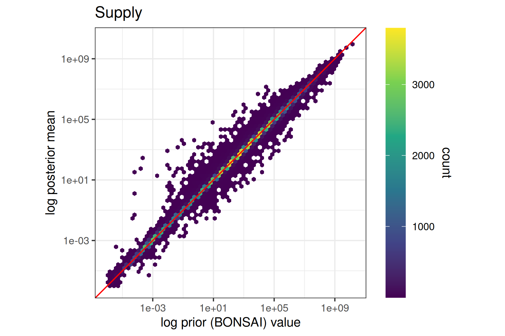{width="100%"}
:::

::: {.column width="50%"}
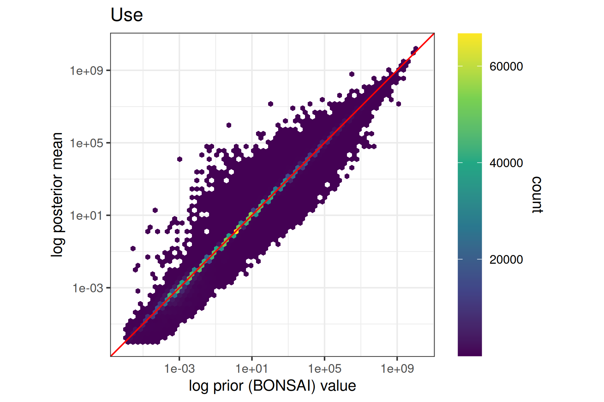{width="100%"}
:::
:::::

## 1b) how much does balancing move the table?

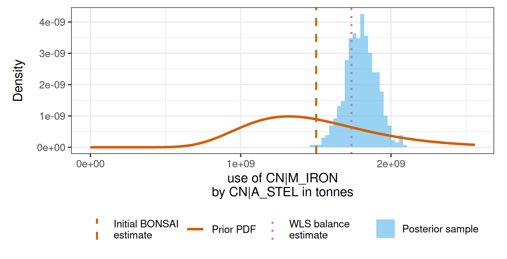

------------------------------------------------------------------------

## 2) Before & After balancing

![Product constraint \[tonnes\]](plots/plot_prod_balance_tonnes.png){width="100%"}

------------------------------------------------------------------------

## 3) uncertainty changes (selectively)

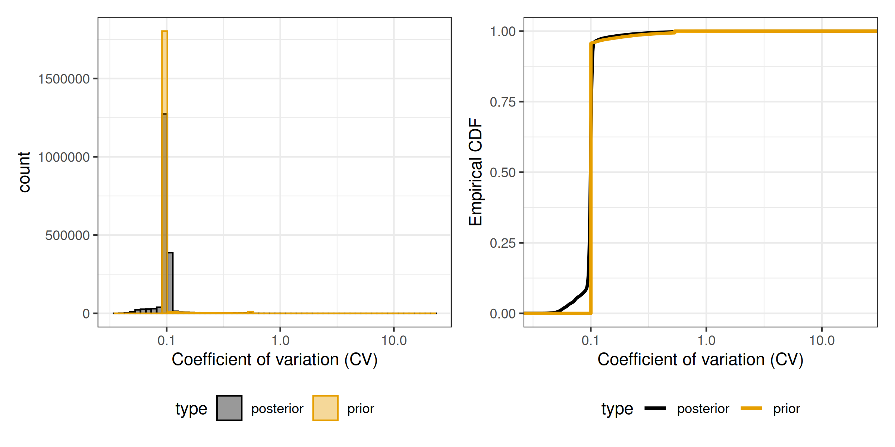{width="90%"}

------------------------------------------------------------------------

## 4) posterior covariance

:::::: columns
::: {.column width="50%"}
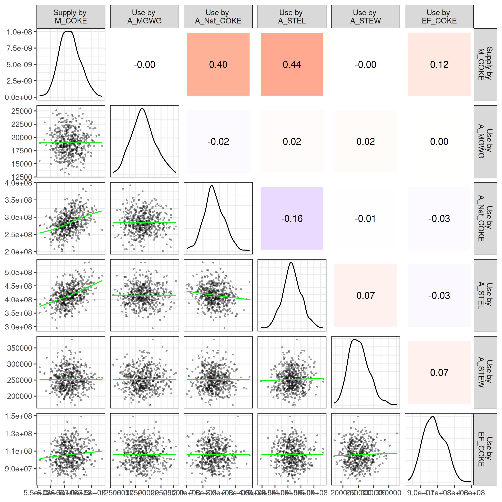{width="92%"}
:::

:::: {.column width="50%"}
-   M_COKE: Chinese coke market
-   A_Nat_COKE: natural coke production
-   A_STEL: steel manufacturing

::: {.callout-note .fragment}
Due to use of soft constraints that still allow for deviation from the constraints, we expect stronger dependencies when tightening the allowed log-ratio deviation from the constraints, which are currently set relatively moderate $\mathrm{rel\_tol}_*$ between 0.05 and 0.2
:::
::::
::::::

------------------------------------------------------------------------

## 5) comparison with deterministic WLS

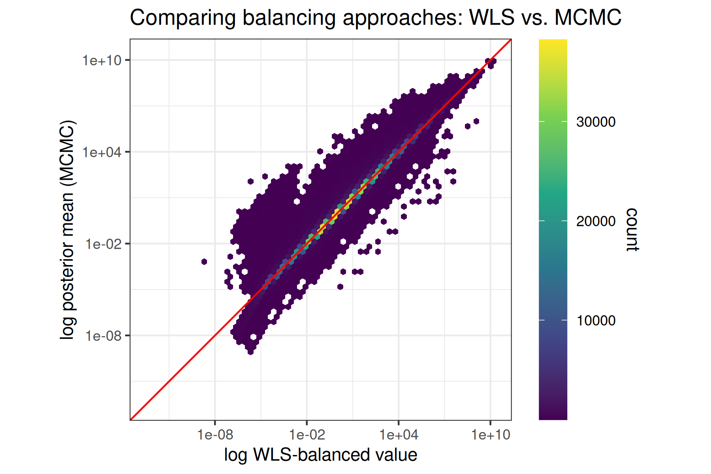{width="100%"}

------------------------------------------------------------------------

## What this enables for statistical offices & MRIO compilers

1.  **Uncertainty-aware SUTs** (intervals + covariance)
2.  **Diagnostics** (where constraints bind; tension between layers)
3.  **Transparent trade-offs** (explicit tolerances and priors)
4.  **Assess uncertainty of any downstream indicator** (e.g. $P(\mathrm{A}) > P(\mathrm{B})$)

------------------------------------------------------------------------

## Limitations of the current prototype

-   prior variances largely data-driven based on prior imbalances (due to computational reasons)

-   global (coarse) uncertainty parameters for some linkages (conversion between layers, transfer coefficients)

-   soft constraints require care (tolerances matter)

-   computational optimisation: post-processing/memory pipeline, MCMC

------------------------------------------------------------------------

## Outlook / collaboration

-   Empirically grounded prior elicitation (source/flow specific)
-   tighter tolerances
-   testing Bayesian approximations (e.g. Pathfinder, Variational Inference)
-   generalizations: zero handling, time-series (temporal consistency & information transfer)
-   create a usable tool

------------------------------------------------------------------------

## Discussion

1.  What tolerances (=deviations from constraints) would you consider acceptable for the respective constraints?

2.  What kind of uncertainty info can statistical offices provide (to be encoded as priors)?

3.  IO practitioners: What would you need to make use of such an uncertainty-aware SUT? (data: full samples, covariances, ...; tools: propagate uncertainty further downstream, ...; etc.)

------------------------------------------------------------------------

## Thank you

-   Slides + code: (add repo link / DOI)
-   Contact: (add email)

# Additional slides

# The model

## Model variables (1)

Supply & Use flows:

$$
\log x^{(\mathrm{sup},l)}_i \sim \mathcal{N}\bigl(\mu^{(\mathrm{sup},l)}_i,\;\sigma^{(\mathrm{sup},l)\,2}_i\bigr)
$$

$$
\log x^{(\mathrm{use},l)}_i \sim \mathcal{N}\bigl(\mu^{(\mathrm{use},l)}_i,\;\sigma^{(\mathrm{use},l)\,2}_i\bigr)
$$

Conversion factors:

$$
x^{(cf,l_1\rightarrow l_2)}_i \sim \mathcal{N}(y^{(cf,l_1\rightarrow l_2)}_i,\;\sigma^{(cf,l_1\rightarrow l_2)2}_i)
$$

## Model variables (2)

Transfer coefficient:

$$
x^{(\mathrm{tc})}_i \sim \mathrm{Beta}(\alpha^{(\mathrm{tc})}_i,\;\beta^{(\mathrm{tc})}_i)
$$

$$
y^{(\mathrm{tc})}_i \sim \mathcal{N}(x^{(\mathrm{tc})}_i,\;\sigma^{(\mathrm{tc})2}_i)
$$

## Prior variances (Supply & Use flows) (1)

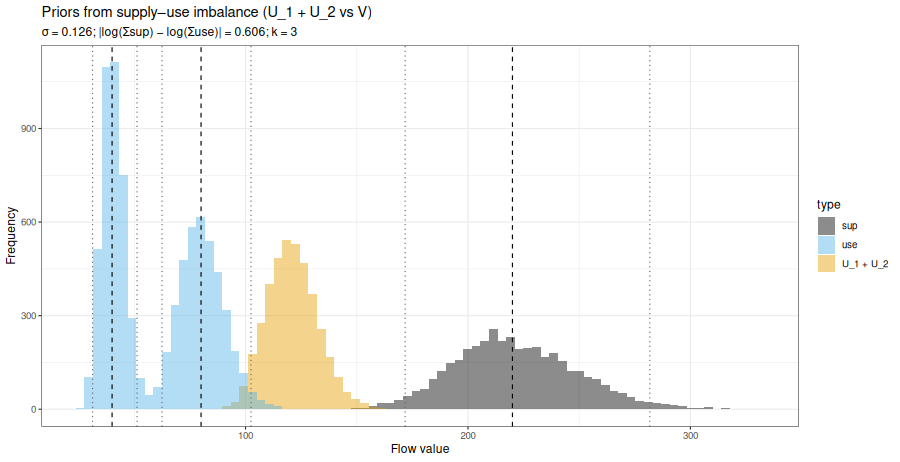

## Prior variances (Supply & Use flows) (2)

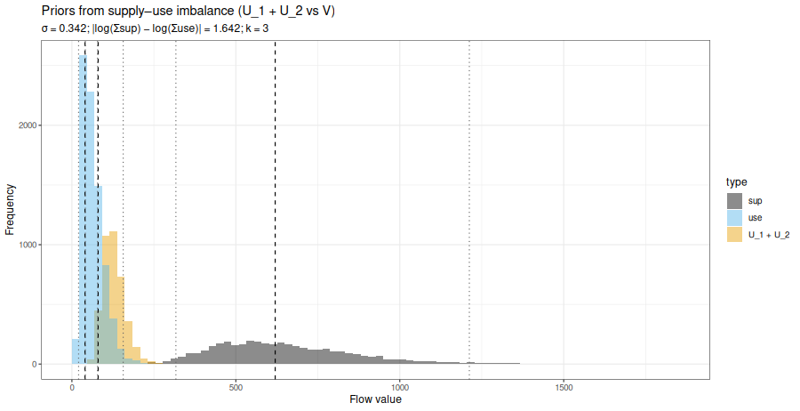

## Prior variances (Supply & Use flows) (3)

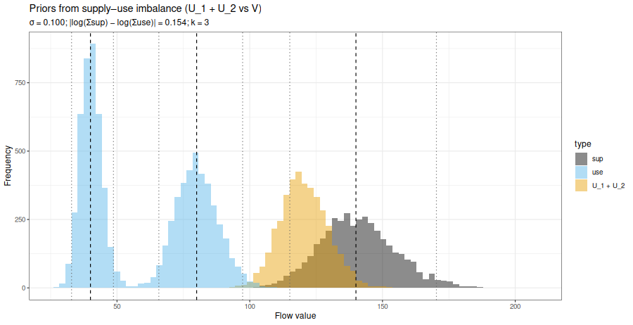

---

## Product & Activity constraints

Product constraint:

$$
\log\frac{s^{(l)}_{\mathrm{pr},j} + \epsilon}{l^{(l)}_{\mathrm{pr},j} + \epsilon}
\sim \mathcal{N}(0,\;\mathrm{rel\_tol}_{\mathrm{product}}^2)
$$

Activity constraint:

$$
\log\frac{o^{(l)}_{\mathrm{ar},k} + \epsilon}{i^{(l)}_{\mathrm{ar},k} + \epsilon}
\sim \mathcal{N}(0,\;\mathrm{rel\_tol}_{\mathrm{activity}}^2)
$$

## Conversion factor consistency

$$
\text{converted}^{(\mathrm{sup},l_2)}_i
=
x^{(\mathrm{sup},l_1)}_i \cdot x^{(cf,l_1\rightarrow l_2)}_i,
$$

$$
\text{reference}^{(\mathrm{sup},l_2)}_i = x^{(\mathrm{sup},l_2)}_i
$$

(and analogously for use flows $x^{(\mathrm{use},l)}$).

Soft log-ratio constraint:

$$
\log \frac{
\text{converted}^{(\cdot)}_i + \epsilon
}{
\text{reference}^{(\cdot)}_i + \epsilon
}
\sim \mathcal{N}\!\left(0,\;\mathrm{rel\_tol}_{\mathrm{conv\_fac}}^{2}\right)
$$

## Transfer coefficient consistency {.smaller}

-   First, we have to aggregate supply and use to the product-activity-region (PAR) level (e.g.\~total use of steel in car manufacturing in Germany, or supply of cars from car manufacturing in Germany) using aggregation matrices $\mathbf{A}^{(\cdot)}_{par}$ : $$
    \mathbf{x}^{(\mathrm{use},\mathrm{tonnes})}_{\mathrm{par}} = \mathbf{A}^{(\mathrm{use},\mathrm{tonnes})}_{\mathrm{par}} \, \mathbf{x}^{(\mathrm{use},\mathrm{tonnes})} ; 
    \mathbf{x}^{(\mathrm{sup},\mathrm{tonnes})}_{\mathrm{par}} = \mathbf{A}^{(\mathrm{sup},\mathrm{tonnes})}_{\mathrm{par}} \, \mathbf{x}^{(\mathrm{sup},\mathrm{tonnes})}
    $$

-   Second, we compute the expected supply from the transfer coefficients by multiplying the transfer coefficient record with the respective use-flow at the PAR-level: $$
    x^{(\mathrm{exp\_sup},\mathrm{tonnes})}_{\mathrm{par},i}
    =
    x^{(\mathrm{tc})}_i \cdot
    x^{(\mathrm{use},\mathrm{tonnes})}_{\mathrm{par}, i}
    $$

-   Third, we again apply a soft log-ratio constraint so that the observed PAR-level supplies in tonnes must approximately match expected supplies implied via transfer coefficients: $$
      \log\frac{ x^{(\mathrm{exp\_sup},\mathrm{tonnes})}_{\mathrm{par},i} + \epsilon }{ x^{(\mathrm{sup},\mathrm{tonnes})}_{\mathrm{par},i} + \epsilon } \sim \mathcal{N}\left(0, \mathrm{rel\_tol}_{\mathrm{tc}}^{2}\right)
      $$

## Before/After balancing (product balance, Mill. Euro)

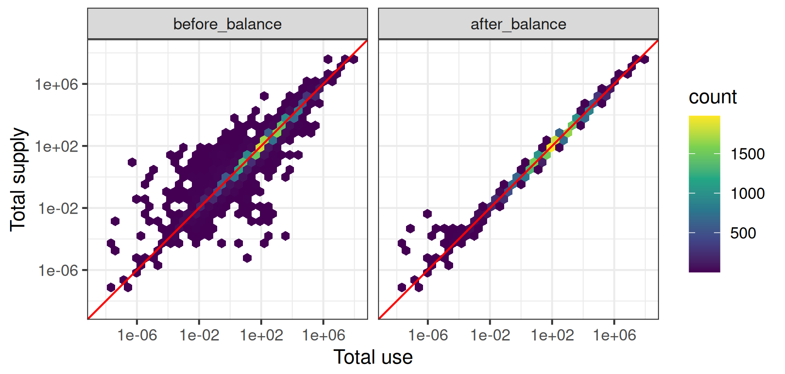

## Before/After balancing (product balance, TJ)

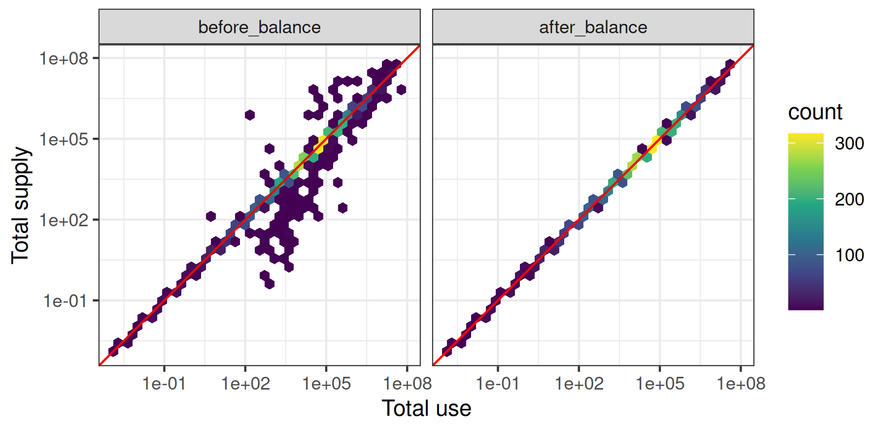

## Before/After balancing (activity balance, tonnes)

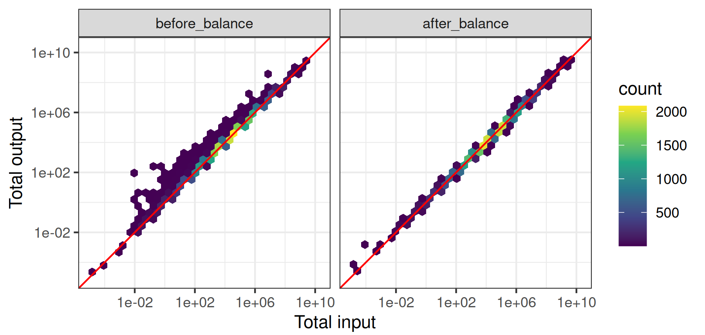

## Before/After balancing (activity balance, Mill. Euro)

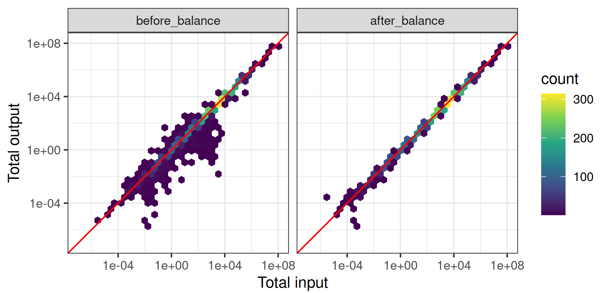

## Before/After balancing (activity balance, TJ)

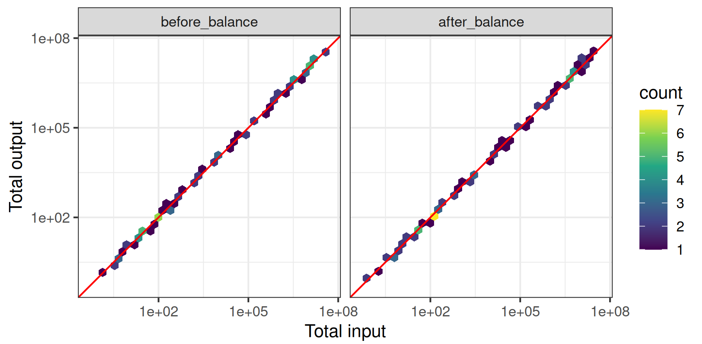